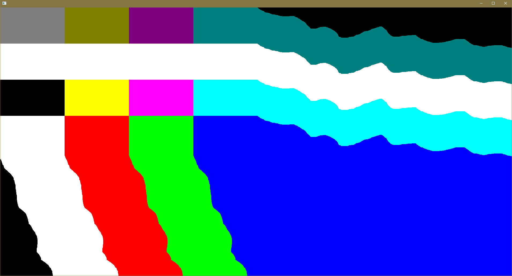

# memgarden
A menagerie of homebrew projects coalesced into a cohesive whole.

## UNDER CONSTRUCTION
Assembling code-snippets surviving a decade long culling by sparking joy...

# TLDR build & run
### WINDOWS:
Open development console at project root.
Build by running compile.bat.
Execute with run.bat.

## Current State Snippet
A small os-layer abstraction interface for creating gui-apps.
